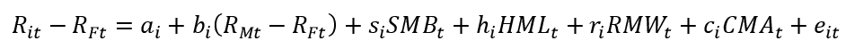
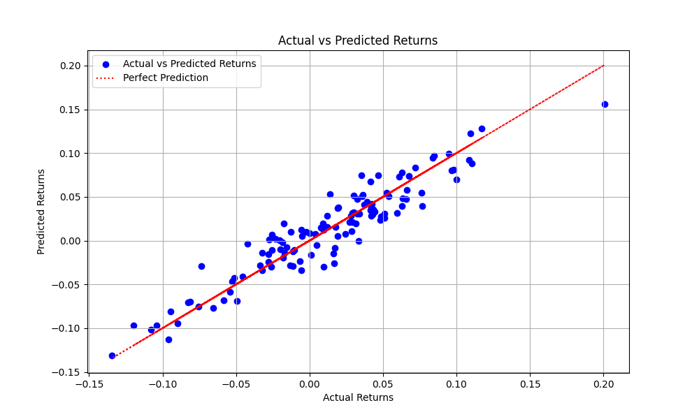
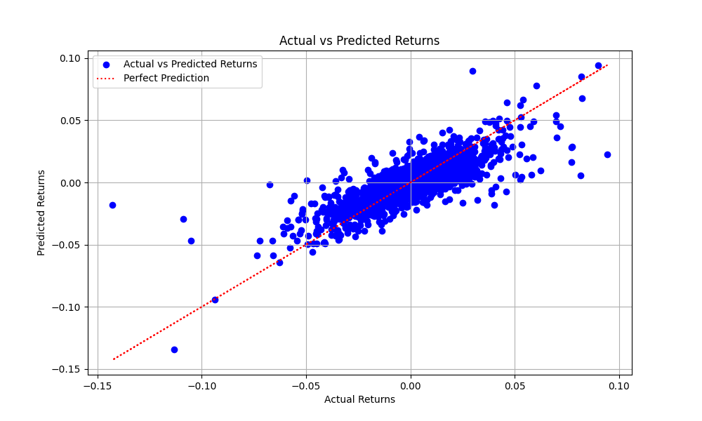

# Fama-French Five Factor Model

The [Fama-French Five Factor Mode](https://mba.tuck.dartmouth.edu/pages/faculty/ken.french/data_library.htm) is an extension of the [Capital Asset Pricing Model](https://www.investopedia.com/terms/c/capm.asp) and the [Fama-French Three Factor Model](https://www.investopedia.com/terms/f/famaandfrenchthreefactormodel.asp).

- **Residual Return of the Portfolio (Rit - Rft)**

  - Definition: The excess return of the portfolio over the risk-free rate, after accounting for the systematic risk factors in the Fama-French five-factor model.

- **Market Risk Premium (Rmt-Rft)**:

  - Definition: Excess return of the market portfolio over the risk-free rate.

- **Size (SMB)**:

  - Definition: Return difference between small-cap stocks and large-cap stocks.

- **Value (HML)**:

  - Definition: Return difference between high book-to-market (value) stocks and low book-to-market (growth) stocks.

- **Operating Profitability (RMW)**:

  - Definition: Return difference between stocks of companies with high and low operating profitability.

- **Investment (CMA)**:
  - Definition: Return difference between stocks of companies that invest conservatively and those that invest aggressively.

## Findings with FAANG and QQQ Porfolios

### QQQ Growth Fund

1. **R-Squared Statistic**: The R-squared statistic is 89%, indicating that approximately 89% of the variance in the QQQ index fund's residual return is explained by the independent variables in the model.

2. **Alpha (const)**: The alpha (constant) is 0.0011. Positive monthly alphas suggest good performance of the QQQ index fund.

3. **Market Risk Premium (Mkt-RF)**: The coefficient for the market risk premium (Mkt-RF) is 1.1238. A beta greater than 1 (1.1238) indicates that the fund has higher volatility compared to the market.

4. **Size (SMB)**: The coefficient for size (SMB) is -0.1436. A negative coefficient suggests that the fund tends to invest more in larger stocks.

5. **Value (HML)**: The coefficient for value (HML) is -0.3056. A negative coefficient indicates that the fund tends to invest more in growth stocks, which aligns with the objective of the QQQ growth fund.

6. **Operating Profitability (RMW)**: The coefficient for operating profitability (RMW) is 6.063e-05. This coefficient is not statistically significant, suggesting that operating profitability may not have a significant impact on the QQQ index fund's performance during this period.

7. **Investment (CMA)**: The coefficient for investment (CMA) is -0.0014. Similar to operating profitability, this coefficient is not statistically significant, indicating that investment may not have a significant impact on the QQQ index fund's performance.

### FAANG Five Asset Portfolio

1. **R-Squared Statistic**: The R-squared statistic is 63.7%, indicating that approximately 63.7% of the variance in the portfolio's residual return is explained by the independent variables in the model.

2. **Alpha (const)**: The alpha (constant) is 0.0004. This coefficient represents the excess return of the portfolio beyond what would be expected given its exposure to the market and other factors. A positive alpha indicates outperformance relative to the market.

3. **Market Risk Premium (Mkt-RF)**: The coefficient for the market risk premium (Mkt-RF) is 1.0698. A beta greater than 1 (1.0698) indicates that the portfolio has higher volatility compared to the market.

4. **Size (SMB)**: The coefficient for size (SMB) is -0.2162. A negative coefficient suggests that the portfolio tends to have exposure to larger stocks. This makes sense with our portfolio because FAANG consists solely of Big Tech.

5. **Value (HML)**: The coefficient for value (HML) is -0.4030. A negative coefficient indicates that the portfolio tends to have exposure to growth stocks.

6. **Operating Profitability (RMW)**: The coefficient for operating profitability (RMW) is -0.0005. This coefficient is not statistically significant, suggesting that operating profitability may not have a significant impact on the portfolio's performance during this period.

7. **Investment (CMA)**: The coefficient for investment (CMA) is -0.0081. This coefficient is statistically significant, indicating that the portfolio's performance may be affected by investment activities.

## Acknowledgements

Stock_Analysis Libaries Forked from @stefmolin
